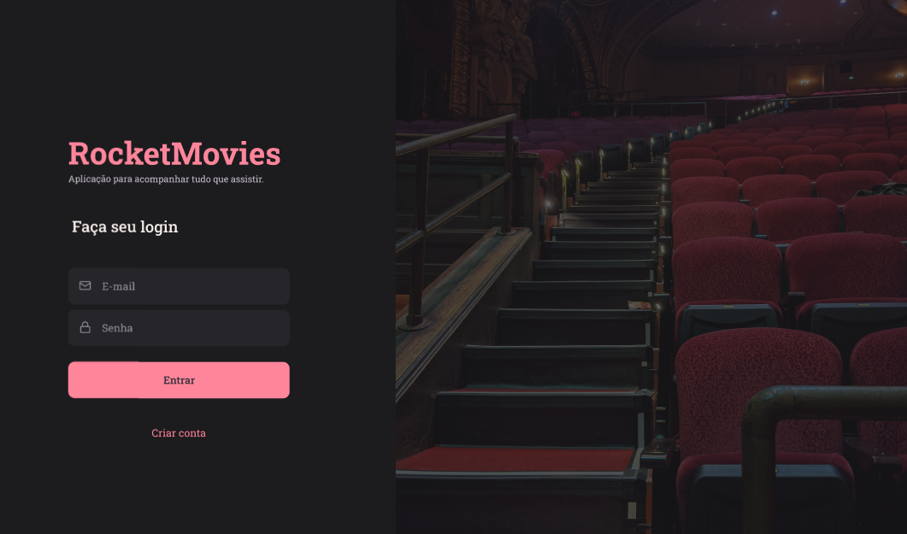

# Rocket-movies

 

Página web criada em React a partir de layout no figma.
Desafio do explorer da  da Rockeseat. 

## 🚀 Começando - 

Rocketmovies é o front-end de uma aplicação que possui back-end em node.js e será responsavel por salvar os filmes favoritos dos usuários e suas respectivas notas.

### 📋 Pré-requisitos

### 🔧 Instalação

## 📦 Desenvolvimento

É uma página em react que renderiza os componentes em HTML e CSS

## 🛠️ Construído com

REACT, HTML, CSS

## 📌 Versão

Versão única

## ✒️ Autores

 * **Explorer Rocketseat**

* **Marcelo dos Santos cerqueira** - *Trabalho Inicial* - [Marcelo Cerqueira](https://www.linkedin.com/in/marcelo-cerqueira-0a0b42178/)

## 🎁 Agradecimentos

* Gratidão à equipe Rocketseat

---
⌨️ com ❤️ por [Marcelo Cerqueira](https://gist.github.com/Marcelocerqueira) 😊
